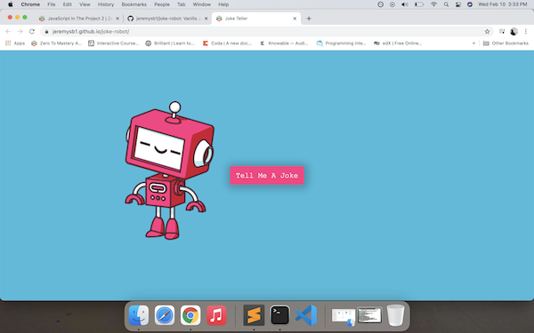

# A Dancing Robot Telling Jokes

I learned how to create functions leveraging text to speech API's using the async function.

The dancing robot tells jokes from a text to speech API and it gets its jokes from a jokes API.

## The Dancing Robot

As the picturre suggests, the user will push the button and robot will tell a joke.
